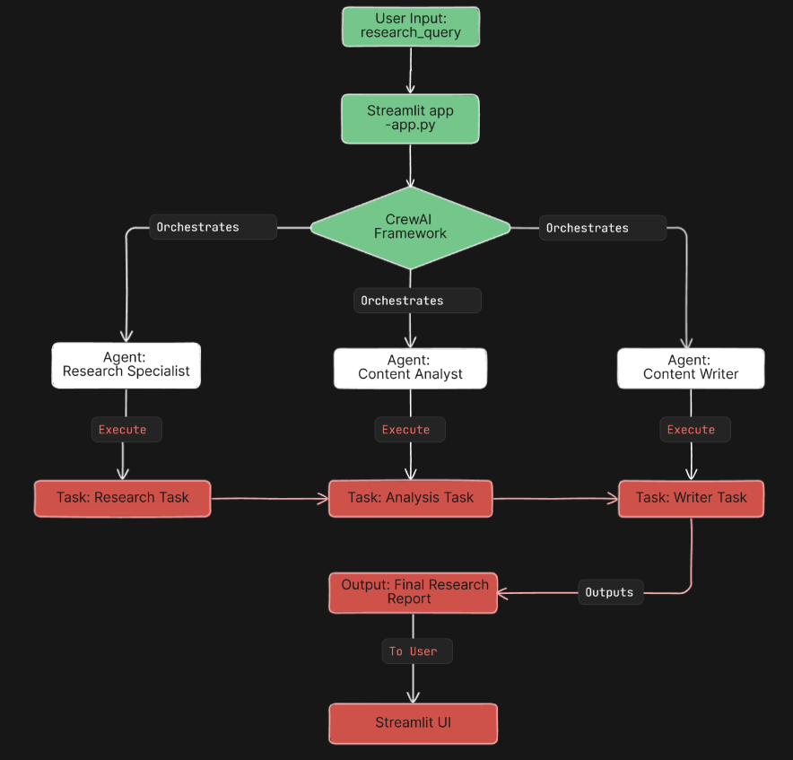

# **AI Research Assistant using CrewAI**

A multi-agent AI system designed to automate and streamline the research workflow using the **CrewAI framework**, **LLMs**, and **Streamlit**. The assistant handles research queries by orchestrating agents that specialize in information retrieval, content analysis, and final report writing.

## **Architecture Overview**

    

### **Components:**

- **User Input:** Research query (via Streamlit UI)
- **CrewAI Framework:** Coordinates agent execution and task flow
- **Agents:**
  - Research Specialist: Performs knowledge retrieval using RAG
  - Content Analyst: Analyzes and filters the content
  - Content Writer: Drafts the final research summary
- **Tasks:**
  - Research → Analysis → Writing
- **Output:** A complete, structured final research report

## **Features**

- Multi-agent system with defined roles
- Retrieval-Augmented Generation (RAG) for enhanced factual grounding
- End-to-end pipeline from input to research summary
- Streamlit-based UI for seamless user interaction
